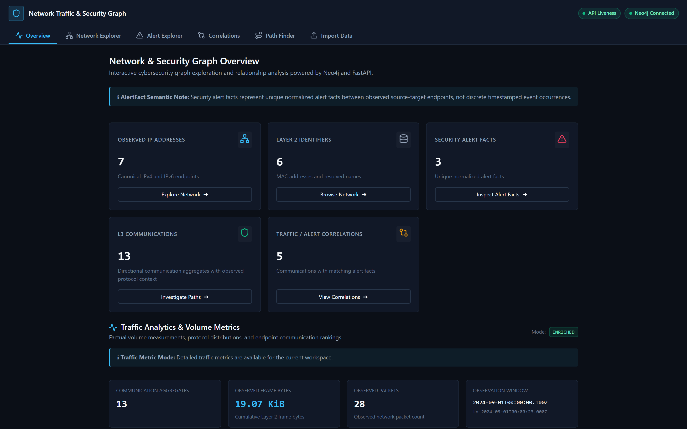
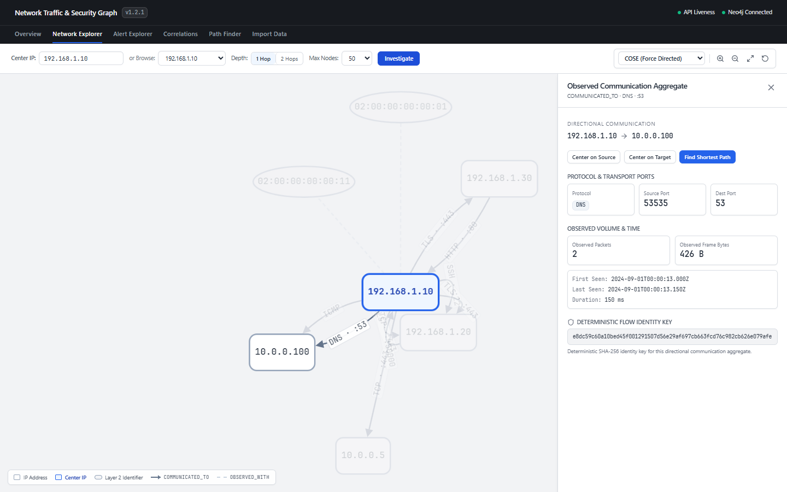
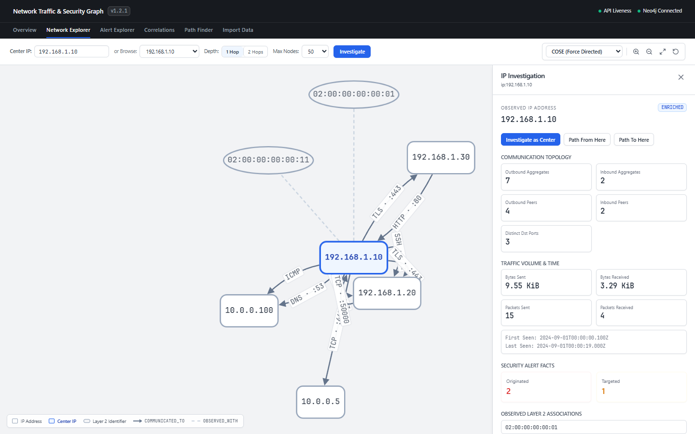
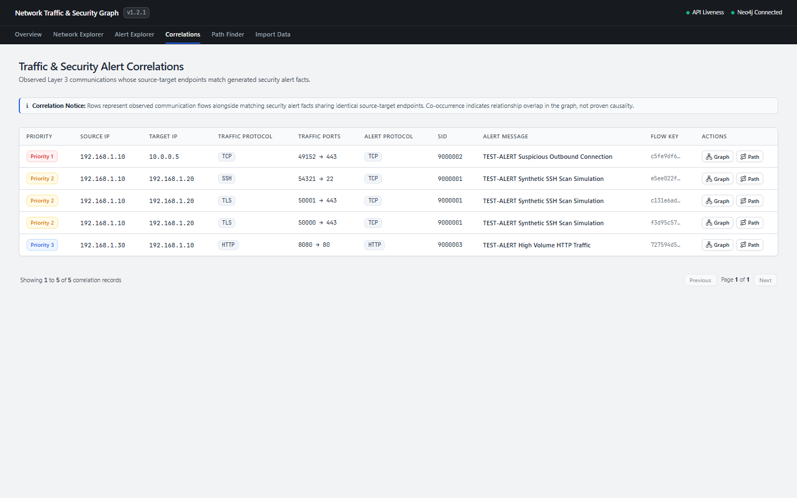

# Network Traffic & Security Alert Analysis with Neo4j

[](https://github.com/s3rt4c/neo4j_project/actions/workflows/ci.yml)


Graph-based cybersecurity analysis platform transforming network traffic exports (basic TSV or enriched tshark exports) and Snort/IDS alerts into an interactive Neo4j property graph with a typed FastAPI backend and React + Cytoscape.js dashboard.



> **Origin & Evolution:** Originally developed during a cybersecurity internship (September 2024), this system was re-engineered into a portfolio-grade cybersecurity tool. It features a typed dual-mode traffic pipeline, deterministic SHA-256 flow aggregation, fact-based Neo4j property graph persistence, a read-optimized FastAPI backend, and an interactive React + Cytoscape.js dashboard.

---

## Technical Highlights

- **Deterministic Flow Aggregation:** Computes canonical SHA-256 `flow_key` identifiers for directional 5-tuples `(src_ip, dst_ip, protocol, src_port, dst_port)`, preserving parallel flows as distinct graph relationships.
- **Dual-Mode Traffic Ingestion Pipeline:** Seamlessly ingests both basic 7-column network exports and rich 14-column tshark/Wireshark observation profiles with wire frame bytes and observation timestamps.
- **Normalized Fact-Based Graph Model:** Persists Layer 3 communication aggregates, Layer 2 Ethernet frame topology, Layer 2/3 associations, and normalized `:AlertFact` entities using batched `UNWIND` Cypher operations with Neo4j 5.x constraints.
- **Read-Oriented FastAPI REST API:** High-performance backend providing OpenAPI (Swagger/ReDoc) documentation, Pydantic v2 schemas, and dedicated endpoints for traffic volume metrics, endpoint rankings, and graph traversals.
- **Interactive Graph Visualizer & Inspectors:** React 19 + TypeScript + Cytoscape.js interface supporting multiple layouts, parallel edge rendering, edge inspection drawer (`CommunicationEdgePanel`), and IP context drawer (`IPDetailPanel`).
- **Atomic Browser Data Import:** Gated single active workspace replacement (`DATA_IMPORT_ENABLED=true`) with stateless multi-file validation, size limits, pre-flight diagnostics, and transactional rollback protection.
- **Rigorous Verification & CI:** Comprehensive test suite with 150+ pytest and vitest test cases, opt-in live Neo4j integration testing with disposable containers, and multi-version Python CI (3.10 and 3.14).

---

## Quick Demo with Synthetic Samples

Run the complete stack locally in 60 seconds using the included synthetic datasets:

```bash
# 1. Start disposable Neo4j test container
docker compose up -d neo4j-test

# 2. Configure environment
cp .env.example .env
# Set in .env:
# NEO4J_URI=bolt://localhost:17687
# NEO4J_PASSWORD=phase6-test-password
# DATA_IMPORT_ENABLED=true

# 3. Start Backend API (Terminal 1)
uvicorn src.api.app:app --host 127.0.0.1 --port 8000

# 4. Start Frontend Web Dashboard (Terminal 2)
cd frontend && npm install && npm run dev
```

Open `http://localhost:5173`, navigate to **Import Data**, select `data/samples/sample_traffic_enriched.tsv` and `data/samples/sample_alerts.json`, click **Validate Files**, check confirmation, and click **Import & Analyze**.

---

## What It Does

The platform correlates network traffic exports and IDS alert facts in Neo4j across three operational modes:

1. **Network traffic only** &mdash; Layer 2 MAC topology, IP addresses, observed protocols, transport ports, packet counts, frame bytes, observation windows, and hop path exploration.
2. **IDS/Snort alerts only** &mdash; Unique normalized alert facts with signature IDs, priority levels, protocol/port metadata, and source-target IP investigation.
3. **Network traffic + IDS alerts together** &mdash; Unified topology, traffic volume analytics, alert fact analysis, and cross-domain correlation where matching endpoint evidence exists.

---

## Conceptual Architecture

```
 Traffic Exports (TSV)          IDS Alerts (JSON)
           │                           │
           └─────────────┬─────────────┘
                         ▼
             Parsing & Normalization
         (src/ingestion/, src/services/)
                         │
                         ▼
               Neo4j Property Graph
        (batched UNWIND write persistence)
                         │
                         ▼
               FastAPI REST Backend
         (read queries, analytics, graph)
                         │
                         ▼
        React 19 + Cytoscape.js Dashboard
    (overview, network explorer, inspectors)
```

[View detailed architecture & directory layout &rarr;](docs/ARCHITECTURE.md)

---

## Technologies

| Layer | Technologies |
|---|---|
| **Backend** | Python 3.10+, FastAPI, Pydantic v2, pandas, python-dotenv |
| **Database** | Neo4j 5.x (Cypher batched UNWIND, uniqueness constraints, RANGE indexes) |
| **Frontend** | React 19, TypeScript 5.x, Cytoscape.js 3+, Vite 8 |
| **Testing & CI** | pytest, Vitest, Docker Compose, GitHub Actions CI (Python 3.10/3.14, Node 24) |

---

## Screenshots

### Network Explorer & Communication Edge Inspector
Interactive graph canvas preserving parallel multi-flow curves between host pairs. Selecting an edge opens the Communication Aggregate Inspector displaying transport ports, packet counts, frame bytes, observation window, and SHA-256 `flow_key`.



### IP Investigation Drawer
Detailed endpoint drawer displaying inbound/outbound aggregate counts, peer diversity, destination ports, traffic volume totals, observation timestamps, and Layer 2 MAC associations.



### Cross-Domain Traffic & Alert Correlations
Flow-aware correlation table pairing observed communications with security alert facts matching source and target IP addresses, complete with transport ports, rule IDs, and priority levels.



---

## Automated Testing & Quality

- **Backend Unit & API Tests:** `pytest` (145+ unit tests covering dual-mode parsers, models, and FastAPI routes).
- **Opt-In Live Neo4j Integration:** Real graph persistence, constraint enforcement, and atomic rollback verification against disposable Neo4j containers (`pytest -m integration`).
- **Frontend Quality:** 50 Vitest component tests, TypeScript type checks, ESLint, and production build verification.
- **Continuous Integration:** GitHub Actions matrix verifying Python 3.10, Python 3.14, Node 24, and live Neo4j on every pull request.

---

## Semantic Boundaries

> **Analysis & Safety Notice:**
> - **Directional Communication Aggregate (`COMMUNICATED_TO`):** Represents an observed directional aggregation identified by `(src_ip, dst_ip, protocol, src_port, dst_port)`. It is **not** a reconstructed TCP session or connection state machine.
> - **Observed Frame Bytes (`observed_bytes`):** Sum of reported `frame.len` values across aggregated observations (wire frame bytes including headers, **not** application payload bytes).
> - **Correlation vs Causation:** Traffic/alert co-occurrence reflects shared endpoint evidence in captured data and does **not** prove causality.
> - **Source / Target Semantics:** Directional endpoints reflect communication orientation and do **not** infer attacker or victim roles.

[Read comprehensive traffic model & semantic definitions &rarr;](docs/TRAFFIC_MODEL.md)

---

## Documentation Index

| Document | Description |
|---|---|
| [Architecture & System Design](docs/ARCHITECTURE.md) | Component architecture, data flows, and codebase directory layout |
| [Traffic Ingestion & Graph Model](docs/TRAFFIC_MODEL.md) | Input formats, flow aggregation, Neo4j schema, metric modes, and analysis boundaries |
| [REST API Reference](docs/API.md) | Complete endpoint specifications, query parameters, sorting, and filtering |
| [Browser Import & Security](docs/IMPORT_SECURITY.md) | Gated workspace replacement, concurrency locking, and security considerations |
| [Migration Guide](docs/MIGRATION.md) | v1.1 &rarr; v1.2 graph identity changes and re-ingestion guidance |

---

## Synthetic Sample Datasets

All sample data included in the repository is 100% synthetic RFC 1918 / RFC 3849 test data:
- `data/samples/sample_traffic.tsv` &mdash; Basic 7-column synthetic traffic export.
- `data/samples/sample_traffic_enriched.tsv` &mdash; Enriched synthetic tshark export (28 raw rows &rarr; 13 communication aggregates, 19,532 frame bytes, parallel TLS flows, DNS, HTTP, SSH, ICMP).
- `data/samples/sample_alerts.json` &mdash; Synthetic IDS alert fact array with signature IDs and priorities.

---

## License

This project is part of a cybersecurity internship portfolio. License TBD.
